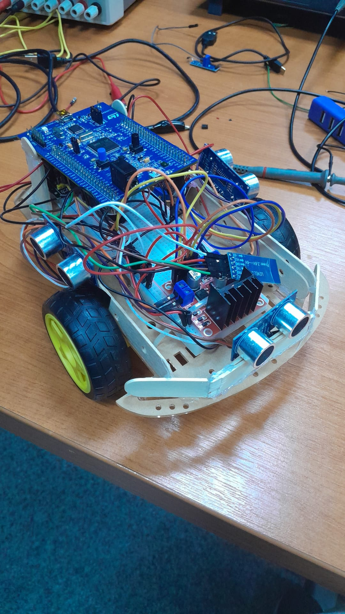

# iTEC 2025 - Maze Solving Robot

Code developed for the IT Engineering Contest (ITEC) 2025 edition, Embedded Development track (ITEC#18).



## Project Overview

This project implements an autonomous maze-solving robot built around the STM32F407G-DISC1 development board. The robot navigates unknown mazes using ultrasonic sensors and a right-hand rule algorithm, mapping the environment in real-time and transmitting the maze data back to a computer via Bluetooth for visualization.

**Challenge**: Navigate and solve an unknown maze within competition constraints.
**Development Time**: 44 hours
**Competition**: ITEC#18 (IT Engineering Contest 2025)

## Team Information

This robot was built in just 44 hours as part of the competition challenge by a 2-person team:

- **Christian Micea - me**
- **[Dragoș Mâțu](https://github.com/Saltspeddy)**

## Algorithm

The robot uses the **right-hand rule** maze-solving algorithm:

1. **Always prefer turning right** when possible (if right path is clear > 26cm)
2. **Move forward** if the front is clear (> 26cm) but right is blocked
3. **Turn left** only when both right and front are blocked but left is clear (> 26cm)
4. **Back up and reposition** when all three directions are blocked (dead end)

The robot maintains a 101x101 matrix representing the maze, tracking its position (X, Y coordinates) and heading (0=north, 1=east, 2=south, 3=west) as it navigates. Each visited cell is marked in the matrix for later transmission.

## Hardware Components

### Main Controller
- **STM32F407G-DISC1** development board (ARM Cortex-M4, 168MHz)

### Sensors
- **3x HC-SR04P** ultrasonic sensors (front, left, right) for distance measurement
  - Range: 2cm to 400cm
  - Used for obstacle detection and wall following

### Motors & Control
- **2x Standard DC motors** for locomotion
- **L298N motor driver** for H-bridge motor control
- PWM-based speed control via TIM3

### Power Management
- **XL6009 boost voltage module** for power regulation

### Connectivity
- **HC-05 Bluetooth module** for wireless communication
  - Baud rate: 9600
  - Used for remote control and data transmission

### Prototyping
- **1 Breadboard** for circuit assembly

## Software Tools

- **STM32CubeIDE** - Main development environment and compiler
- **STM32CubeMX** - Configuration code generator
  - .IOC files contain visual hardware configuration
  - Generates initialization code for peripherals (GPIO, TIM, UART, I2C, SPI, etc.)

**How STM32CubeMX Works:**

STM32CubeMX is a graphical tool that auto-generates a significant portion of the code in this project. Here's why:

1. **Visual Configuration**: Instead of writing complex register-level code for hardware setup, you visually configure pins, peripherals, clocks, and interrupts in a graphical interface
2. **Code Generation**: CubeMX generates all the initialization code (MX_GPIO_Init, MX_TIM1_Init, MX_USART2_UART_Init, etc.) based on your visual configuration
3. **HAL Abstraction**: It generates Hardware Abstraction Layer (HAL) code that simplifies working with STM32 peripherals
4. **User Code Sections**: The generated code includes marked sections (`/* USER CODE BEGIN */` and `/* USER CODE END */`) where developers can add their custom logic without it being overwritten when regenerating

**Why So Much Auto-Generated Code?**

Embedded development requires extensive hardware initialization - setting up GPIO pins, configuring timers for PWM, initializing UART communication, configuring I2C/SPI buses, setting up system clocks, and more. CubeMX handles all this boilerplate code automatically, allowing developers to focus on the application logic (the maze navigation algorithm in this case) rather than low-level hardware configuration.

**Note**: .IOC files can only be opened with STM32CubeMX. The generated C code is hardware-specific and requires the actual hardware to run properly.

## Project Structure

```
Code_from_Github/iTEC_2025_Embedded/
├── Maze_Solving_Robot/              # Final robot implementation
│   ├── Core/
│   │   └── Src/
│   │       └── main.c              # Main robot code with maze navigation
│   └── python_scripts/
│       └── serialComm.py           # Bluetooth communication script
├── component_tests/                # Individual component test projects
│   ├── Ultrasonic_test/            # Single ultrasonic sensor + OLED
│   ├── Ultrasonic_test_2/          # Ultrasonic sensor testing
│   ├── Ultrasonic_triple_test/     # 3-sensor testing with LEDs
│   ├── PWM-Motor-test/             # Motor control testing
│   ├── PWM_1_Motor_Test/           # Single motor testing
│   ├── Bluetooth_Device_Test/      # Bluetooth module testing
│   ├── Bluetooth_test_2/           # Bluetooth communication testing
│   ├── Serial_Monitor_Test/        # UART communication testing
│   ├── STM32_USB_VSC_link/         # USB connection testing
│   ├── Blink_LED_Button/           # Basic GPIO testing
│   └── test2/                      # Miscellaneous tests
└── README.md
```

## Usage/Workflow

### Robot Operation

1. Power on the robot - it waits for a start command via Bluetooth
2. Send any character via Bluetooth to begin maze navigation
3. Robot autonomously navigates the maze using the right-hand rule
4. Robot continuously updates its internal maze matrix (101x101)

### Data Retrieval and Visualization

1. **Connect to robot** via Bluetooth (HC-05 module) from your laptop
2. **Run the Python script** to communicate with the robot:
   ```bash
   python Maze_Solving_Robot/python_scripts/serialComm.py
   ```
   - Configure `SERIAL_PORT` to match your Bluetooth COM port
   - Script sends 'N' command to stop the robot
   - Robot transmits the maze matrix line by line via UART
3. **Process the matrix data** - The script receives a 100x100 matrix of 0s and 1s
4. **Visualize the maze** - Use a separate visualization script (not included in this repo) to render the maze graphically

**Note**: The graphical visualization script was developed separately and is not included in this repository.

## Code Details and Implementation

### Main Robot Code (`Maze_Solving_Robot/Core/Src/main.c`)

**Key Functions:**

- `giveDistSensorFront()`, `giveDistSensorLeft()`, `giveDistSensorRight()`
  - Read ultrasonic sensors using TIM1 for precise timing
  - Return distance in centimeters

- `moveForward()`, `turnLeft()`, `turnRight()`, `moveBack()`, `moveStop()`
  - Motor control functions using PWM (TIM3)
  - Calibrated PWM values for straight movement and turns

- `labirynthTest()`
  - Main navigation loop implementing right-hand rule
  - Reads all three sensors
  - Makes navigation decisions based on distance thresholds
  - Updates position and heading
  - Marks visited cells in the maze matrix

- `printMatrix()`
  - Transmits the maze matrix via UART
  - Called when 'N' command is received

**UART Communication:**
- Baud rate: 9600
- Commands:
  - Any character: Start robot navigation
  - 'N' (ASCII 78): Stop robot and transmit maze matrix
  - 'Y' (ASCII 89): Stop robot (no matrix transmission)

### Python Communication Script (`Maze_Solving_Robot/python_scripts/serialComm.py`)

**Features:**
- Connects to robot via Bluetooth serial port
- Sends 'N' command to trigger matrix transmission
- Reads 100x100 matrix line by line
- Handles incomplete lines and decoding errors
- Outputs the complete matrix to console

**Configuration:**
```python
SERIAL_PORT = 'COM12'  # Change to your Bluetooth COM port
BAUD_RATE = 9600
MATRIX_ROWS = 100
MATRIX_COLS = 100
```

## Important Notes

- This code is hardware-specific and requires the actual robot hardware to run
- The maze visualization script is not included in this repository
- Distance thresholds (26cm for clear path, 7cm for obstacle) were calibrated for the specific maze dimensions in the competition
